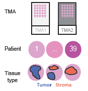
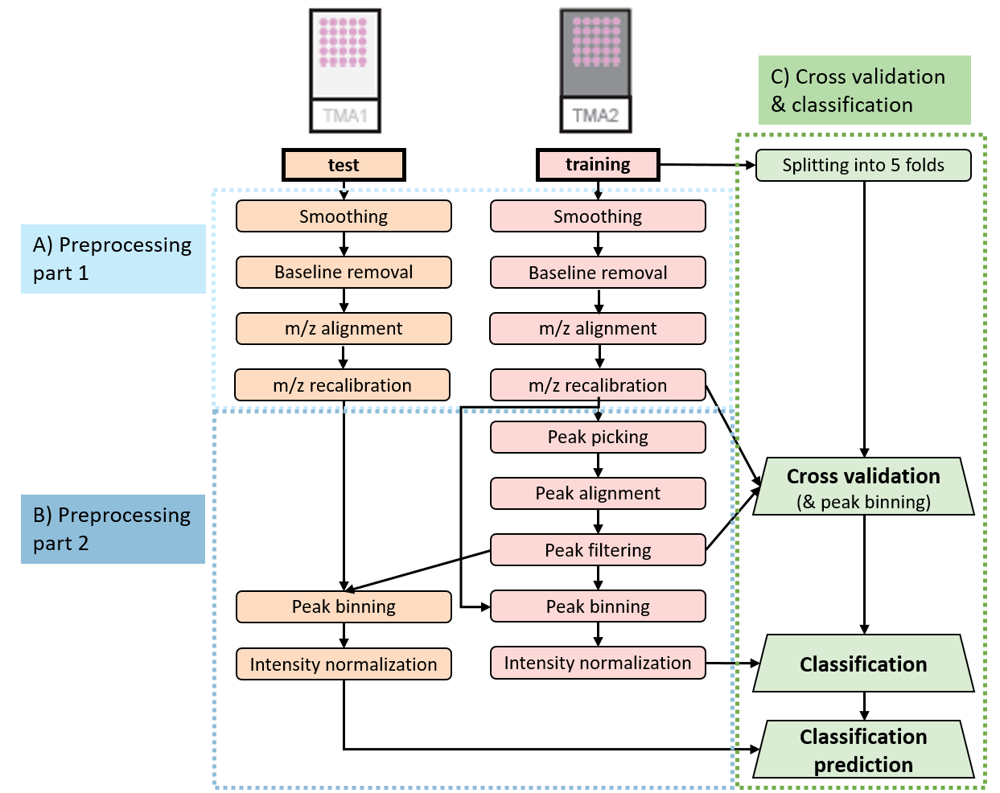

```{r setup, include=FALSE}
knitr::opts_chunk$set(echo = TRUE, message=FALSE)
```

# Introduction 

In case study 3, we present pre-processing and classification on a multi-replicate dataset containing 39 bladder tumor and benign tissue cores in two tissue microarrays (TMAs). The dataset was annotated by pathologists for tumor and stroma as regions of interests (ROI) and we will classify these tumor vs. stroma tissues.



First, we load the Cardinal and the ggplot2 package. In case Cardinal is not yet installed, download it from Bioconductor as described here.

```{r, results='hide', message=FALSE}

# Install Cardinal if not yet done
#if (!require("BiocManager", quietly = TRUE))
#    install.packages("BiocManager")
#BiocManager::install("Cardinal")

library(Cardinal)
library(ggplot2)

```

# Data import

The raw and metadata are available via the PRIDE repository with the project identifier [PXD026459](
https://www.ebi.ac.uk/pride/archive/projects/PXD026459). 
Here, we will load the raw data in the Analyze7.5 format. First, we download the three subfiles: hdr, img, t2m for both TMAs to the local computer and in the next step we import the data into Cardinal. 


```{r load-analyze-files}

TMA1 <- readAnalyze(name="TMA1")
TMA2 <- readAnalyze(name="TMA2")

```

To check successful import and get an overview of the files, we look at the file summaries

```{r vis-analyze-files}

TMA1
TMA2

```

TMA2 was measured with a shorter m/z axis than TMA1, thus we will later transfer the m/z peaklist from TMA2 to TMA1.

Next we download the spectra annotation files from PRIDE and import them into R. 

```{r load-spectra-annotations}

TMA1_annotations <- read.delim(file="TMA1_annotations.txt", header = TRUE, stringsAsFactors = FALSE)
TMA2_annotations <- read.delim(file="TMA2_annotations.txt", header = TRUE, stringsAsFactors = FALSE)

```

We have a look at the metadata. 

```{r vis-spectra-annotations}

head(TMA1_annotations)
head(TMA2_annotations)

```

The spectra are annotated with information about the spectra coordinates giving the location of each spectrum, TMA number, histology which contains the tissue type (tumor or stroma), diagnosis, invasiveness of the cancers, and patient number. 

# Preparing raw and metadata

First we filter the annotation data to remove all spectra that are not part of tumor or stroma tissues.

```{r prepare-spectra-annotations}

# Keeping only spectra annotations with tumor or stroma annotation in each TMA
TMA1_tumor_stroma <- TMA1_annotations[TMA1_annotations$histology == "Stroma" | TMA1_annotations$histology == "Tumor",]
TMA2_tumor_stroma <- TMA2_annotations[TMA2_annotations$histology == "Stroma" | TMA2_annotations$histology == "Tumor",]

```

Then we repeat the step and keep only spectra in the MSI data that obtained an annotation as tumor/stroma. 

```{r metadata-filtering}

# Generation of a logical vector that indicates for each spectrum if it has a tumor / stroma annotation or not
annotated_spectra_TMA1 <- paste(coord(TMA1)$x, coord(TMA1)$y, sep="_") %in% paste(TMA1_tumor_stroma$x, TMA1_tumor_stroma$y, sep="_")
annotated_spectra_TMA2 <- paste(coord(TMA2)$x, coord(TMA2)$y, sep="_") %in% paste(TMA2_tumor_stroma$x, TMA2_tumor_stroma$y, sep="_")

# Filtering to keep only spectra that have a tumor / stroma annotation
TMA1_ROIs <- TMA1[,annotated_spectra_TMA1]
TMA2_ROIs <- TMA2[,annotated_spectra_TMA2]

```

Then we attach the metadata to the raw data.

```{r attach-metadata}

# order spectra coordinates to have them in same order in MSI data and metadata
TMA1_annot_ordered <- TMA1_tumor_stroma[with(TMA1_tumor_stroma, order(y,x)), ]
TMA2_annot_ordered <- TMA2_tumor_stroma[with(TMA2_tumor_stroma, order(y,x)), ]

# control that coordinates order is the same
head(TMA1_annot_ordered)
head(pixelData(TMA1_ROIs))

# combine the additional metadata and the pixel data (pData) of the MSI data
TMA1_metadata <- cbind(as.data.frame(pixelData(TMA1_ROIs)), TMA1_annot_ordered[4:7])
TMA2_metadata <- cbind(as.data.frame(pixelData(TMA2_ROIs)), TMA2_annot_ordered[4:7])

# attach the metadata dataframe to the MSI data, this requires defining the coordinates and run in the PositionDataFrame, which is a special data frame that holds metadata directly attached to the MSI data
pixelData(TMA1_ROIs) <- PositionDataFrame(coord = TMA1_metadata[,2:3], run=TMA1_metadata$run,                                         TMA1_metadata[,c("histology", "diagnosis", "invasiveness", "patient")])

pixelData(TMA2_ROIs) <- PositionDataFrame(coord = TMA2_metadata[,2:3],
                                            run=TMA2_metadata$run, 
                                            TMA2_metadata[,c("histology", "diagnosis", "invasiveness", "patient")])


```

To get an overview of the annotations, we visualize the spectra annotations of each file. 

```{r viz-annotations}

## Patients
patients_plot = ggplot(as.data.frame(pData(TMA1_ROIs)), aes(x=x, y=y, fill=patient))+
                           geom_tile(height = 1, width=1, show.legend=FALSE)+
                           coord_fixed()+
                           ggtitle("Different patients")+
                           theme_bw()+
                           theme(plot.title = element_text(hjust = 0.5))+
                           theme(text=element_text(family="ArialMT", face="bold", size=12))+
                           ##theme(legend.position="bottom",legend.direction="vertical")+
                           ##theme(legend.key.size = unit(0.2, "line"), legend.text = element_text(size = 10))+
                           ##guides(fill=guide_legend(ncol=4,byrow=TRUE))+
                           scale_discrete_manual(aesthetics = c("colour", "fill"), values = colorRampPalette(c("hotpink", "plum", "plum4", "violet", "magenta", "magenta4", "mediumorchid3", "mediumorchid4", "purple", "purple4"))(19))

# calculate mean x and mean y position for each patient tissue
coord_labels = aggregate(cbind(x,y)~patient, data=pData(TMA1_ROIs), mean, na.rm=TRUE, na.action="na.pass") 
                       
for(file_count in 1:nrow(coord_labels))
	{patients_plot = patients_plot + annotate("text",x=coord_labels[file_count,"x"],
	y=coord_labels[file_count,"y"],label=toString(coord_labels[file_count,1]))
}
                       
patients_plot

# histology
image(TMA1_ROIs,histology ~ x * y, col = c("royalblue","coral2"), main= "Tumor and stroma spectra", layout = c(1,2), key=TRUE)
col = colorRampPalette(c("hotpink", "plum", "plum4", "violet", "magenta", "magenta4", "mediumorchid3", "mediumorchid4", "purple", "purple4"))(39)

# run
image(TMA1_ROIs,run ~ x * y, col=c("grey48", "grey30"), main = "TMA (Run)", key=TRUE, layout=NULL)

# patients TMA2
patients_plot2 = ggplot(as.data.frame(pData(TMA2_ROIs)), aes(x=x, y=y, fill=patient))+
                           geom_tile(height = 1, width=1, show.legend=FALSE)+
                           coord_fixed()+
                           ggtitle("Different patients")+
                           theme_bw()+
                           theme(plot.title = element_text(hjust = 0.5))+
                           theme(text=element_text(family="ArialMT", face="bold", size=12))+
                           ##theme(legend.position="bottom",legend.direction="vertical")+
                           ##theme(legend.key.size = unit(0.2, "line"), legend.text = element_text(size = 10))+
                           ##guides(fill=guide_legend(ncol=4,byrow=TRUE))+
                           scale_discrete_manual(aesthetics = c("colour", "fill"), values = colorRampPalette(c("hotpink", "plum", "plum4", "violet", "magenta", "magenta4", "mediumorchid3", "mediumorchid4", "purple", "purple4"))(20))

# calculate mean x and mean y position for each patient tissue
coord_labels2 = aggregate(cbind(x,y)~patient, data=pData(TMA2_ROIs), mean, na.rm=TRUE, na.action="na.pass")

for(file_count in 1:nrow(coord_labels2))
	{patients_plot2 = patients_plot2 + annotate("text",x=coord_labels2[file_count,"x"],
	y=coord_labels2[file_count,"y"],label=toString(coord_labels2[file_count,1]))
}
   
patients_plot2
                    
                    
# histology
image(TMA2_ROIs,histology ~ x * y, col = c("royalblue","coral2"), main = "Tumor and stroma spectra", key=TRUE, layout=c(1,2))
col = colorRampPalette(c("hotpink", "plum", "plum4", "violet", "magenta", "magenta4", "mediumorchid3", "mediumorchid4", "purple", "purple4"))(39)
# run
image(TMA2_ROIs,run ~ x * y, col=c("grey48", "grey30"), main = "TMA (Run)", key=TRUE, layout=NULL)

```

# Pre-processing

For classification, we need to split the data into a training and test data set. It is important that the same subjects (patients) are either present in the training or in the test group but not in both. For this dataset it means that tumor and stroma region of the same patient have to be in the same set. Ideally, the training and test dataset are independent. Even though the tissues in TMA1 and TMA2 were similarly handled and are from a single institute, they were at least measured in separated runs. Thus, we will use TMA1 and TMA2 as test and training set respectively in the classification. To borrow as little information as possible between the two datasets, we keep them separate during preprocessing and only transfer the m/z positions from TMA2 to TMA1. 



## Spectral processing and mass alignment

Pre-processing is performed in several steps in order to be able to visualize the intermediate results. First we perform spectra smoothing and baseline reduction, which is recommended for low mass resolution MALDI-TOF imaging data.

```{r pp-smoothing-baseline}

TMA1_smoothed_blremoved <- TMA1_ROIs %>% 
  smoothSignal(method="gaussian", window=8, sd = 2) %>% 
  reduceBaseline(fun=median, blocks = 750) %>%
  process()

TMA2_smoothed_blremoved <- TMA2_ROIs %>% 
  smoothSignal(method="gaussian", window=8, sd = 2) %>% 
  reduceBaseline(fun=median, blocks = 750) %>%
  process()

```

Next, we perform m/z alignment in order to remove m/z shifts between spectra. 

```{r pp-mz-align}

TMA1_mzaligned <- TMA1_smoothed_blremoved %>%
  mzAlign(tolerance = 200, units = "ppm") %>%
  process()

TMA2_mzaligned <- TMA2_smoothed_blremoved %>%
  mzAlign(tolerance = 200, units = "ppm") %>%
  process()

```

We visualize the success of the m/z alignment by plotting a few randomly chosen spectra before and afterwards for each TMA.

```{r vis-mz-align}

par(mfrow = c(2,1), xpd=FALSE)
plot(TMA1_smoothed_blremoved, pixel=c(22,219, 497, 725, 803,1000),  xlim=c(1295, 1315), ylim=c(0,10),key=FALSE, superpose=TRUE, main="TMA1 before alignment", layout=c(2,1))
par(xpd=FALSE)
plot(TMA1_mzaligned, pixel=c(22,219, 497, 725, 803,1000), xlim=c(1295, 1315), ylim=c(0,10),key=FALSE, superpose=TRUE, main="after alignment", layout=NULL)

par(mfrow = c(2,1), xpd=FALSE)
plot(TMA2_smoothed_blremoved, pixel=c(22,219, 497, 725, 803,1000), xlim=c(1295, 1315), ylim=c(0,45),key=FALSE, superpose=TRUE, main="TMA2 before alignment", layout=c(2,1))
par(xpd=FALSE)
plot(TMA2_mzaligned, pixel=c(22,219, 497, 725, 803,1000), xlim=c(1295, 1315), ylim=c(0,45),key=FALSE, superpose=TRUE, main="after alignment", layout=NULL)


```

Then we perform mass re-calibration by using the same function with internal calibrants as a reference. The internal calibrants angiotensin (m/z 1296.69), substance P (m/z 1347.72), fibrinopeptide B (m/z 1570.68) were mixed with the matrix and thus equally distributed over the tissue. 805.42 is an autolysis peptide of trypsin that we include as well as trypsin was sprayed equally over the tissue section.

```{r pp-recalibration}

calibrant_mz <- c(805.42, 1296.69, 1347.72, 1570.68)

TMA1_recalibrated <- TMA1_mzaligned %>%
  mzAlign(ref=calibrant_mz, tolerance=200, units="ppm") %>%
  process()

TMA2_recalibrated <- TMA2_mzaligned %>%
  mzAlign(ref=calibrant_mz, tolerance=200, units="ppm") %>%
  process()

```

We obtain one warning for TMA1: 'no matching peaks found; try a larger tolerance'. For each spectrum that is not successfully aligned one line of warning is written, thus we just continue and don't bother about this single spectrum that generated a warning. 

Again, we visualize for each TMA a few spectra before and after re-calibration to control its success.

```{r vis-recalibration}

par(mfrow = c(2,1), xpd=FALSE)
plot(TMA1_mzaligned, pixel=c(22, 219, 497, 725, 803, 1000), xlim=c(1295, 1300), ylim=c(0,10),key=FALSE, superpose=TRUE, main="TMA1 before recalibration", layout = c(2,1),xpd=FALSE)
abline(v=1296.69, lty=2)# theor m/z Angiotensin
par(xpd=FALSE)
plot(TMA1_recalibrated, pixel=c(22, 219, 497, 725, 803, 1000), xlim=c(1295, 1300), ylim=c(0,10),key=FALSE, superpose=TRUE, main="after recalibration", layout=NULL ,xpd=FALSE)
abline(v=1296.69, lty=2)# theor m/z Angiotensin

par(mfrow = c(2,1), xpd=FALSE)
plot(TMA2_mzaligned, pixel=c(22, 219, 497, 725, 803, 1000), xlim=c(1295, 1300), ylim=c(0,20),key=FALSE, superpose=TRUE, main="TMA2 before recalibration", layout = c(2,1),xpd=FALSE)
abline(v=1296.69,lty=2)# theor m/z Angiotensin
par(xpd=FALSE)
plot(TMA2_recalibrated, pixel=c(22, 219, 497, 725, 803, 1000), xlim=c(1295, 1300), ylim=c(0,20),key=FALSE, superpose=TRUE, main="after recalibration", layout=NULL,xpd=FALSE)
abline(v=1296.69,lty=2)# theor m/z Angiotensin

```

## Peak picking and filtering

Next, we perform peak picking, alignment and filtering only on TMA2. 

```{r pp-picking-alignment-filtering}

# peak picking, peak alignment and filtering for 1 % presence
TMA2_pp <- TMA2_recalibrated %>%
  peakPick(method = "simple", SNR=5, window = 10, blocks = 500) %>%
  peakAlign(tolerance = 200, units = "ppm") %>%
  peakFilter(freq.min = 0.01) %>%
  process()

```


Then, we use the peaklist from TMA2 to extract the peak area, from the re-calibrated (profile mode) data for both, TMA1 and TMA2. 

```{r pp-peakbinning}

# list of picked m/z features
peakpicked_mz <- mz(TMA2_pp)

# extract original intensities for picked m/z features by peak integration
TMA1_peakbinned <- TMA1_recalibrated %>%
  peakBin(tolerance=200, units="ppm", ref=peakpicked_mz) %>%
  process()

TMA2_peakbinned <- TMA2_recalibrated %>%
  peakBin(tolerance=200, units="ppm", ref=peakpicked_mz) %>%
  process()

```

Last, we perform intensity normalization to the total ion current (TIC) and export the pre-processed data as .Rdata file in order to keep all the metadata attached to the MSI data.

```{r pp-normalization}

TMA1_normalized <- TMA1_peakbinned %>%
  normalize(method="tic") %>%
  process()

TMA2_normalized <- TMA2_peakbinned %>%
  normalize(method="tic") %>%
  process()

save(TMA1_normalized, file="TMA1_preprocessed.RData")
save(TMA2_normalized, file="TMA2_preprocessed.RData")


```

# Cross-validation and classification

In order to find optimal classification parameters cross validation is performed. We will split the dataset into 5 groups (also called folds) with 4 patients each. During cross validation the data from 4 groups are used for classification and then tested on the remaining group. This is repeated in order to have all combinations of groups as training and test data. We will perform classification first with the Spatial Shrunken Centroids (SSC) method and repeat it then with the partial least squares regression (PLS) method. 


```{r generating-folds}

# Inputs: 
head(TMA2_metadata)
unique(TMA2_metadata$patient) # 20 patients

## randomly split into 5 groups
set.seed(1)
folds <- split(unique(TMA2_metadata$patient), sample(20, 5))
fold_dataframe <- data.frame(unlist(folds), c(rep(1, 4), rep(2, 4), rep(3, 4), rep (4,4), rep(5,4)))
colnames(fold_dataframe) <- c("patient", "folds")
rownames(fold_dataframe) <- NULL

# merge dataframe with folds to metadata and attach it to the MSI data which will be used for cross validation
pixelData(TMA2_recalibrated)$folds <- merge(TMA2_metadata, fold_dataframe, by.x = "patient")$folds

```
To avoid over-fitting, the training data should not be processed using any information from the test set. Because peak binning is based on the detected peaks, we must detect the peaks independently on the training subsets first without any spectra from the test subsets, then we bin the test subsets according to these peaks. The re-calibrated MSI data of TMA2 (training data) is used as profile mode input and the peaklist from TMA2 is used as a reference.

An alternative approach to pre-processing would be to perform TIC normalization at the beginning. Then the CV for parameter selection would have the exact same pre-processing steps as the training dataset on which SSC is applied. In theory it is possible to also perform TIC normalization on each fold during CV however it is not intrinsically implemented in the function and thereby requires a lot of coding which would have gone beyond the aim of this vignette. 

```{r CV-SSC}

head(peakpicked_mz) # m/z peak list from TMA2
TMA2_recalibrated # profile mode TMA2 data after first pre-processing steps

ssc_cv_bladder <- crossValidate(TMA2_recalibrated, TMA2_recalibrated$histology, 
                                .fun="spatialShrunkenCentroids", 
                                .r = 1, s=c(5,10,15,20,25,30,35,40), 
                                .fold=TMA2_recalibrated$folds, process=TRUE, 
                                .processControl=list(tolerance=200, units="ppm", ref=peakpicked_mz))

plot(summary(ssc_cv_bladder), Accuracy ~ s, type="b")
# manual selection of s: s=25 is the highest s value that still gives a very high accuracy

```

Next, we obtain the optimal parameters for r and s from the crossvalidated data and use them to train the final Spatial Shrunken Centroids classifier on the pre-processed TMA2 dataset. 

```{r SSC}

# classification
ssc_histology <- spatialShrunkenCentroids(TMA2_normalized, 
                                          y = TMA2_normalized$histology,
                                          r = 1, s = 25, 
                                          method = "adaptive")

# classification summary
summary(ssc_histology)

# prediction of classes
image(ssc_histology)

# Average intensity plot per class
plot(ssc_histology, lwd=1.5)

# t-statistic plot
plot(ssc_histology, values='statistic', lwd=1.5)

# Features that are most important to the classification
topFeatures(ssc_histology)

# Number of features that are used for the classification, topFeatures returns only top 10 m/z features, thus we use n=NA to obtain all m/z features. Then we filter for positive statistics value, which means that these m/z features are used for the classification.
sum(topFeatures(ssc_histology, n=NA)$statistic > 0)
```

The built classifier is next used to predict the classes of the test dataset (TMA1). 

```{r prediction-SSC}

ssc_histology_prediction <- predict(ssc_histology, TMA1_normalized, 
                                    newy = TMA1_normalized$histology)
summary(ssc_histology_prediction)

image(ssc_histology_prediction)

```

The classification accuracy is 94% on the test dataset, which is a relatively high classification value. As TMA1 was established in the same institute and prepared and imaged together with TMA2 it is not a completely independent test dataset. For additional tissues from other institutes, prepared in a different laboratory at a different time, we would expect lower accuracies.

As a last step we repeat crossvalidation, classification and prediction with the PLS classification method. PLS takes only one parameter which is the number of components (ncomp). To find the optimal number of components, cross validation is performed. 

```{r pp-CV-PLS}


pls_cv_bladder <- crossValidate(TMA2_recalibrated, .y = TMA2_recalibrated$histology, 
                                .fun="PLS", ncomp= 1:10, 
                                .fold=TMA2_recalibrated$folds, process=TRUE, 
                                .processControl=list(tolerance=200, units="ppm", ref=peakpicked_mz))

plot(summary(pls_cv_bladder), Accuracy ~ ncomp, type="b")

```

```{r PLS}

# extraction of best ncomp value (could also be done manually via the previous plot)
best_n <- summary(pls_cv_bladder)$ncomp[which.max(summary(pls_cv_bladder)$Accuracy)]

# classification
pls_histology <- PLS(TMA2_normalized, y = TMA2_normalized$histology, ncomp = best_n)

# summary
summary(pls_histology)

# prediction of classes
image(pls_histology)

# Plotting of weight, loadings and coefficients for each m/z
plot(pls_histology, values="loadings", lwd=1.5)
plot(pls_histology, values="weight", lwd=1.5)
plot(pls_histology, values='coefficients', lwd=1.5)


```

The built classifier is next used to predict the classes of the test dataset (TMA1). 


```{r predict-PLS}

pls_histology_prediction <- predict(pls_histology, TMA1_normalized, 
                                    newy = TMA1_normalized$histology)
summary(pls_histology_prediction)

image(pls_histology_prediction)

```


The classification accuracy is 92% on the test dataset, which is still a relatively high classification value due to the same reasons discussed above. For this dataset the differences between PLS and SSC are only subtle. However, the feature regularization which is part of the SSC classification enables the selection of the most relevant m/z features and thus an easier interpretation of the results. For PLS the determination of the top m/z features is not straightforward because it is not clear how to interpret all three mesaures (weights, loadings and coefficients) together. 

# Session information

```{r session-info}
sessionInfo()
```


