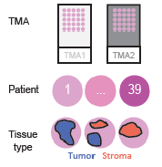
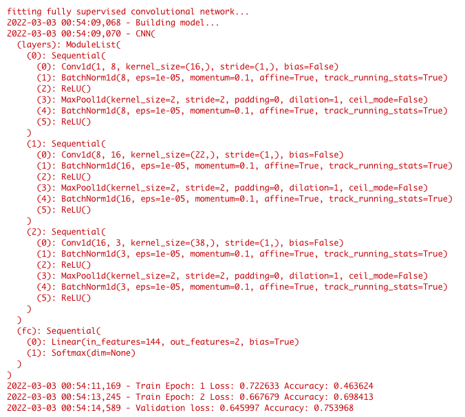

```{r style, echo=FALSE, results='asis'}
BiocStyle::markdown()
library(knitr)
knitr::knit_engines$set(python = reticulate::eng_python)
```


```{r setup-2, echo=FALSE, eval=FALSE} 
data_path <- file.path(getwd(), "0-others/Cardinal2-vignettes/vignettes") 
reticulate_python_path <- file.path("~/Downloads", "dmsi/bin/python") 
console_image_path <- "/Users/sai/Documents/01-NU/phd/0-others/Cardinal2-vignettes/vignettes/console.png" 
```

# Introduction

In case study 4, we apply a special classification to classify tumor and stromal spectra of 39 bladder tumor and benign tissue cores (same dataset as in case study 3). We make use of *CardinalNN*, which is a package of *Cardinal* family. It provides the multiple-instance convolutional neural network [mi-CNN](https://doi.org/10.1093/bioinformatics/btaa436) method, which allows both semi-supervised and fully-supervised deep learning methods for tissue classification for two classes using Mass Spectrometry Imaging (MSI) data. The neural network used as classifier is convolutional neural network (CNN). 

- _Fully supervised_. It is the same as standard supervised classification and it is used when the ground-truth labels of pixels are known.

- _Multiple instance_. It is semi-supervised classification and it is used when only the ground-truth labels of tissues are known while no labels for pixels. The assumption is that positive tissues can contain both positive and negative pixels, while negative tissues can only contain negative pixels.


# Installation

The methods in *CardinalNN* are implemented in R but the deep learning methods are available in Python. The deep learning methods are distributed through the *DeepMSI* python package. As such, CadinalNN uses the implementation in Python but the user does not need any knowledge of Python. It is fully executed from 
within R. However, both Python and a few packages need to be installed and are 
described below. 

NOTE: The below steps (2.1 and 2.2) are essential for successful installation of *CardinalNN* and *DeepMSI* packages. 


## Installation of R-based software

*CardinalNN* can be installed through [GitHub](https://github.com/DanGuo1223/CardinalNN) 
using `devtools`. 

```{r install, eval=FALSE} 
if (!require("devtools", quietly = TRUE))
    install.packages("devtools") 
devtools::install_github("https://github.com/DanGuo1223/CardinalNN")
```


*CardinalNN* will also be distributed through the [Bioconductor](https://bioconductor.org) project in the future and could be installed as below. 

```{r, eval=FALSE} 
install.packages("BiocManager")
BiocManager::install(version="devel")
BiocManager::install("CardinalNN")
```

The same function can be used to update *CardinalNN* and other Bioconductor packages.

Once installed, *CardinalNN* can be loaded with `library()`. We import `reticulate` package to execute python code from within R. 

```{r library, eval=FALSE}
library("CardinalNN") 
library("reticulate") 
```


## Installation of Python-based software

The python package, `DeepMSI` is installed in two steps. 

1. **Download Python**: If you already have python installed, skip this step. 
Download python3 from [this download link](https://www.python.org/downloads/) 
and follow the instructions. If you are on a Windows machine, depending upon 
your OS version, you should select the appropriate Python version to download. 
    * Windows 8 and later: you can install the latest stable release. 
    * Windows XP through Windows 7: the latest version you can install is 
    Python 3.8.10. 
You may also install python using `reticulate`: `reticulate::install_python(version="3.8.10")` 


2. Setup virtual environment for python. 
    * If you are on a Mac or Linux computer, 
        * Open the terminal app ([MacOS help](https://support.apple.com/guide/terminal/open-or-quit-terminal-apd5265185d-f365-44cb-8b09-71a064a42125/mac)) and navigate to Documents folder, use `cd ~/Documents/`. 
        * Create a virtual environment: `python3 -m venv --name deepmsi` 
        * Activate the virtual environment: `source deepmsi/bin/activate` 
        * To deactivate the virtual environment later: `deactivate` 
    
    * If you are on Windows computer, 
        * Open the terminal app ([Windows help](https://docs.microsoft.com/en-us/windows/terminal/install#invoke-the-command-palette)) and run cmd.exe
        and navigate to the Documents directory, `~\Documents`, use the command `cd Documents\` and hit enter).  
        * Create a virtual environment: `c:\PythonXX\python -m venv c:~\Documents\deepmsi`, where `XX` is the version of python you are using or installed as above. 
        * Activate the virtual environment `deepmsi/Scripts/activate`
        

3. Download `DeepMSI` package from GitHub and install the package. 
    * Go to this [GitHub repository](https://github.com/DanGuo1223/DeepMSI/) 
    and click on the drop down menu **Code** in green color. Select 
    **Download ZIP** to download the package. 
    * Go to your Downloads folder and extract the downloaded files from the 
    zip file (DeepMSI.zip). 
    * If you are on a Mac or Linux computer, 
        * Open the terminal app ([MacOS help](https://support.apple.com/guide/terminal/open-or-quit-terminal-apd5265185d-f365-44cb-8b09-71a064a42125/mac)) 
        and navigate to the extracted folder directory using `cd` (for example, 
        if your downloads folder is `~/Downloads`, use the command 
        `cd ~/Downloads/DeepMSI/`). 
        * Install the package using `sudo python3 setup.py install` (if you 
        do not have sudo privilages for the computer, please contact your 
        adminstrator). 
    * If you are on a Windows computer, 
        * Open the terminal app ([Windows help](https://docs.microsoft.com/en-us/windows/terminal/install#invoke-the-command-palette)) and run cmd.exe
        and navigate to the extracted folder directory using `cd` (for example, 
        if your downloads folder is `~\Downloads`, use the command 
        `cd Downloads\DeepMSI-main` and hit enter).  
        * Install the package by copying `py setup.py install` into the terminal and hit enter.


```{r setup, echo=FALSE, message=FALSE, warning=FALSE}
SHARING <- FALSE 
library("CardinalNN")
reticulate::use_python(reticulate_python_path)
```

# Load and prepare the datasets

We use the same dataset as in case study 3. The data files are made available through *massive.quant*. The links for datasets are [TMA1](https://massive.ucsd.edu/ProteoSAFe/DownloadResultFile?file=f.RMSV000000686/2023-02-06_MCFoell_6554995d/other/TMA1_preprocessed.RData) and  [TMA2](https://massive.ucsd.edu/ProteoSAFe/DownloadResultFile?file=f.RMSV000000686/2023-02-06_MCFoell_6554995d/other/TMA2_preprocessed.RData). If you would like to preview the data before downloading, please visit this [link](https://massive.ucsd.edu/ProteoSAFe/dataset_files.jsp?task=9d66bf96de29438cafbad5a3e6634a0b#%7B%22table_sort_history%22%3A%22main.collection_asc%22%7D).
To focus on the classification methods, we import the pre-processed files that we saved in case study 3. 

```{r, echo = TRUE}
load(file.path(data_path, "TMA1_preprocessed.RData"))
load(file.path(data_path, "TMA2_preprocessed.RData"))
```

By exporting the data as .RData object we have the advantage that all the metadata are still linked to each spectrum. We have a look at the metadata to remind us about them.

```{r, echo = TRUE}

pData(TMA1_normalized)
pData(TMA2_normalized)

```

The histology refers to the tissue type, which is either tumor or stroma. The diagnosis contains the diagnosis of the patient from which the tissue is derived. It can be a cancer subtype (infiltrating, low-grade, high-grade) or benign (healthy). Invasiveness distinguishs the muscle infiltrating cancer subtype from the non-muscle infiltrating ones (low-grade, high-grade) but is not further used in this vignette. 



The advantage of this dataset is that each tissue core is not only described by the diagnosis (tissue level annotation) but also the tissue type (histology) of smaller tissue areas with cancer and stromal tissues (subtissue level annotation) were annotated by a pathologist. Thus we will perform two different classifications: 1) fully supervised classification using the subtissue level annotation (plabel), and 2) semi-supervised classification based on the tissue level annotations (tlabel). For an easier data handling we will rename the 'diagnosis' to 'tlabel' and 'histology' to 'plabel' and 'patient' to 'sample'.  We will use TMA2 as the training set and TMA1 as the testing dataset, therefore we also rename them accordingly. In our model, we label (`plabel`) stroma to be group `0` and cancer to be group `1`. 

 
```{r}

#TMA2

colnames(pData(TMA2_normalized))[colnames(pData(TMA2_normalized))=="histology"] <- "plabel"
colnames(pData(TMA2_normalized))[colnames(pData(TMA2_normalized))=="patient"] <- "sample"

mse_train <- TMA2_normalized

mse_train$plabel = ifelse(mse_train$plabel == 'Tumor', 1, 0)
mse_train$tlabel = rep(0, length(mse_train))
for (s in unique(mse_train$sample))
{
  if (sum(mse_train$plabel[mse_train$sample == s]) > 0)
  {
    mse_train$tlabel[mse_train$sample == s] = 1
  }
}

#TMA1

colnames(pData(TMA1_normalized))[colnames(pData(TMA1_normalized))=="histology"] <- "plabel"
colnames(pData(TMA1_normalized))[colnames(pData(TMA1_normalized))=="patient"] <- "sample"

mse_test <- TMA1_normalized

mse_test$plabel = ifelse(mse_test$plabel == 'Tumor', 1, 0)
mse_test$tlabel = rep(0, length(mse_test))
for (s in unique(mse_test$sample))
{
  if (sum(mse_test$plabel[mse_test$sample == s]) > 0)
  {
    mse_test$tlabel[mse_test$sample == s] = 1
  }
}
```

# Fully supervised training

Use `multipleInstanceCNN()` and specify the parameter `method` as 'fully_supervised' to perform standard supervised training on CNN. The parameter, `num_epochs` is the iteration number of complete data passes. For more information on the other parameters such as `batch_size`, `lr`, and `optim`, please use `help('multipleInstanceCNN')`. The network structure and training processes will be printed out in R console.

```{r, eval=TRUE}

micnn_supervised <- multipleInstanceCNN(mse_train, mse_train$tlabel, model_name = 'bladder_classifier1', method = 'fully_supervised', num_epochs = 10)

```



We can use `summary()` to summarize the trained model.

```{r}
summary(micnn_supervised)
```

Plot the predicted class.

```{r,  fig.height=2.5, fig.width=4, fig.align='center'}
image(micnn_supervised)
```

We can use `predict()` to predict the testing data using the trained model and visualize the results.

```{r, fig.height=2.5, fig.width=4, fig.align='center'}
micnn_supervised_predict <- predict(micnn_supervised, newx = mse_test, newy = mse_test$plabel)
image(micnn_supervised_predict)
```


Use `summary()` to summarize the performance of the trained model on testing data if the testing data has ground-truth labels.

```{r}
summary(micnn_supervised_predict)
```


Use `topFeatures()` to rank mass features by weights of explanability. `lime` is a local model-agnostic explanation method, for more detals, please refer to https://github.com/marcotcr/lime. `instance_id` is the id of pixel to be expalined in the testing data. `n` is the number of m/z features the method returned. `topFeatures()` returns a list of m/z features and their coefficient in lime fitting. 

The higher the absolute value of the coefficient is, more important the m/z feature is for the model prediction. Positive value means supporting the model prediction of 1 (tumor) while negative value means supporting the model prediction of 0 (stroma). 

```{r}
micnn_supervised_top <- topFeatures(micnn_supervised, train = train, test = test, method = 'lime', instance_id = 1, n = 10)
micnn_supervised_top
```


Plot barplot of the top features. The explainer method discretizes the `mz` dimension. For example `mz576.383637262 <= 6.57` means that the method is showing the coefficient of `mz = 576.383637262` for the intensities of that feature is less than or equal to 6.57 in the `lime` model.

```{r, fig.height=3, fig.width=6, fig.align='center'}
plot(micnn_supervised_top)
```

# Multiple instance based training

Use `multipleInstanceCNN()` and specify the parameter `method` as 'multiple_instance' to perform standard supervised training on CNN. Throughout this vignette, we set `num_epochs` as 10 for the purposes of illustration. In real model training, a higher `num_epoch` is needed to fully train the model. 

```{r, eval=TRUE}
micnn <- multipleInstanceCNN(mse_train, mse_train$tlabel, model_name = 'bladder_classifier2', method = 'multiple_instance', num_epochs = 10)
```

Summarize the trained model.

```{r}
summary(micnn)
```

Plot the predicted class.

```{r,  fig.height=2.5, fig.width=4, fig.align='center'}
image(micnn)
```

We can use `predict()` to predict the testing data using the trained model and visualize the results.

```{r, fig.height=2.5, fig.width=4, fig.align='center'}
micnn_predict <- predict(micnn, newx = mse_test, newy = mse_test$plabel)
image(micnn_predict)
```

Use `summary()` to summarize the performance of the trained model on testing data if the testing data has ground-truth labels.

```{r}
summary(micnn_predict)
```


Use `topFeatures()` to rank mass features by weights of explanability.

```{r}
micnn_top <- topFeatures(micnn, train = train, test = test, method = 'lime', n = 10)
micnn_top
```


Plot bar plot of the top features. Refer to the plot of `micnn_supervised_top` for interpreting the plot. 

```{r, fig.height = 3, fig.width=6, fig.align='center'}
plot(micnn_top)
```

# Access the results data 

We can access the predictions using `resultData()'. The predictions contain the predicted classes and probabilities of each class.

```{r}
predicted_class <- resultData(micnn_predict)[[1]]$class
predicted_prob <- resultData(micnn_predict)[[1]]$probability
```


use it to subset the MSI data. Subsetting the pixels predicted as 0:

```{r}
mse_sub = mse_test[, predicted_class == 0]
mse_sub
```

Subsetting the pixels predicted as 1:


```{r}
mse_sub = mse_test[,predicted_class == 1]
mse_sub
```

We can visualize the predicted probabilities of the subset of pixels predicted as 1. In the figure, higher probability (lighter color) indicates that the pixel is more likely to belong to group 1 than group 0. 

```{r}
image(mse_sub, predicted_prob[predicted_class==1]~x*y)
```


# Cross validation

When there are not enough samples to split into training and testing data, unlike reporting the accuracy on the testing data, we can report the average accuracy of cross validation. First, we create the x-fold (5-fold for example) split of the data:

```{r, eval=TRUE}
set.seed(1)
folds <- split(unique(mse_train$sample), sample(20, 5))
fold_dataframe <- data.frame(unlist(folds), c(rep(1, 4), rep(2, 4), rep(3, 4), rep (4,4), rep(5,4)))
colnames(fold_dataframe) <- c("patient", "folds")
rownames(fold_dataframe) <- NULL

p_df <- data.frame(mse_train$sample)
colnames(p_df) <- 'patient'
joint_df <- merge(fold_dataframe, p_df, by = 'patient')

mse_train$folds <- joint_df$folds

table(mse_train$folds)
```

Then we fit CNN models for different folds and summarize the accuracy, sensitivity, and specificty:

```{r, eval=TRUE}
micnn_cv <- crossValidate(mse_train, mse_train$plabel, 
                          .fun="multipleInstanceCNN", 
                          .fold=mse_train$folds)
summary(micnn_cv)
```


# Session info 
```{r session-info} 
sessionInfo()
```


